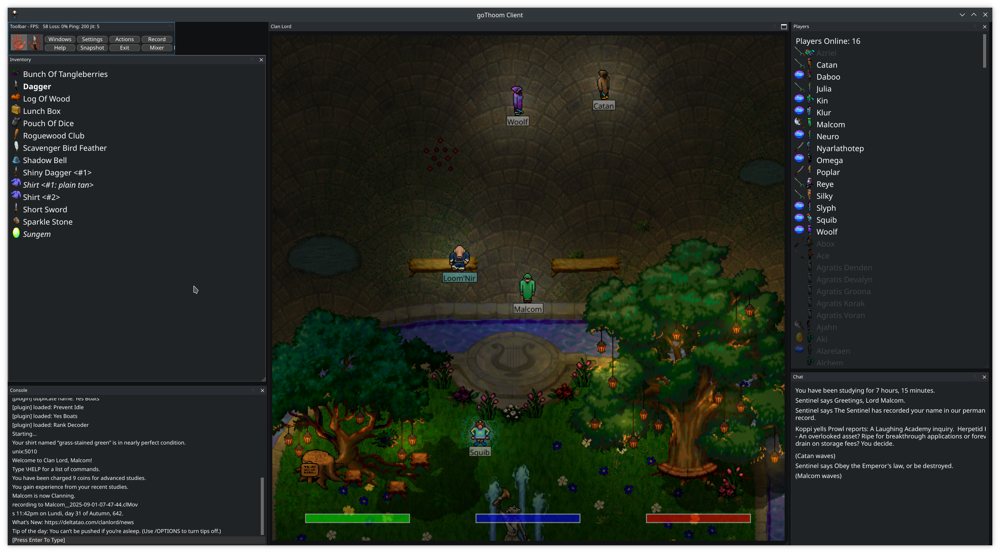

# goThoom

[](https://goreportcard.com/report/github.com/Distortions81/goThoom)
[](LICENSE)
[](https://github.com/Distortions81/goThoom/releases)

An open-source (MIT) client for the classic **[Clan Lord](https://www.deltatao.com/clanlord/)** MMORPG

Approximately 45,000 lines of Go code.




> Status: actively developed, cross-platform builds provided in Releases.

---

## Why I made this

- The windows client is finicky
- 3 to 5 FPS with LCD popping/strobing effects are very hard to look at... I personally really struggle with motion sickness from it.
- The art assets make heavy use of dithering that looked great on small CRTs but look entirely different (and unpleasant) on modern displays without filtering.
- The game window not resizeable (547×540) and didn't look good or fit well on most screens even with OS/VM scaling
- Quicktime MIDI is dead on modern OS X
- Quicktime for Windows is unsupported past Windows 7 (last updated 2009) and is a real security risk
- A number of security concerns with the old client
- All existing (functioning) clients are single-platform and closed-source
- Input schemes are odd or outdated
- Macros seem to be manitory to keep up. Most available are ancient, difficult to find and require fiddling in a odd macro language

## What does goThoom offer?

- Optional Interpolation for smooth movement at any frame-rate with a trade-off of more positional latency (animations and sounds are unaffected)
- Texture processing that intelligently smooths dithering to restore a more CRT-like look to revive lurking color information and reduce popping/strobing effects when moving
- Animation frame blending for a far smoother and pleasant experience that helps the existing animations look their best
- High quality adjustable game window resizing that retains sharpness with very little artifacts
- High quality audio resampling that is very flattering to the original recordings and more pleasant to the ear
* Resampling: (1024-Phase 6-Tap Lanczos Windowed-Sinc),
* Bit depth conversion: TPDF noise shaping with 257 scaling for the best 8-bit to 16-bit conversion possible
- Much higher quality music synthisizer that is more flexible (currently uses a 309MB soundfont file) that is not tied to a dead dependency.
- Built-in local AI text-to-speech with a large choice of voices available online
- Text rendering is anti-aliased and uses high quality modern fonts via OpenType and fractional font sizes are supported
- Many-platform support: Windows, OS X, Linux and others are possible
- Dark mode, light mode or fun colorful themes (even create your own)
- Modern APIs: DirectX on Windows, Metal on OS X and Vulkan via Zink on Linux and even supports software rendering.
* Use of Metal API is important because OpenGL support has been deprecated for ages on OS X and will be stuck at v4.1 and eventually removed.
- Self-contained portable binary, no installers or external dependencies
- Open-source and public domain to prevent it becoming unmaintained abandonware
- Powerful scripting system using a common language, meaning most users will be able to seek support from LLMs.
- Choices for more modern input schemes like enter-to-talk, WASD and use of non-fkeys
* Modern laptops often do not support touchpad + keyboard simultaneously (palm rejection)
* Many modern PCs only have 'media keys' and require you use a function key or mode switch to use. Some only offer touch-screen F-Keys or even no F-Keys at all!

---

## Download
**Easiest:** grab the latest build from **Releases** on this repo (Windows, macOS, Linux).

## Quick start
- On first run, the client **auto-fetches missing game assets** (images, sounds) into `data/`. No manual wrangling.

### Optional extras
- Drop a `background.png` and/or `splash.png` into `data/` for a custom look.

### Text-to-speech voices
Piper voices are stored in `data/piper/voices`. The client and `build-scripts/download_piper.sh` support voice archives in `.tar.gz` format and automatically extract and remove the archives. If a voice archive isn't available, the program falls back to downloading raw `.onnx` models with matching `.onnx.json` configs.

## Using the UI

- Windows: Click the `Windows` toolbar button to toggle common panels: Players, Inventory, Chat, Console, Help, Hotkeys, Shortcuts, Mixer, Settings, and more. Window layout and open/closed state persist between runs.
- Actions: Use the `Actions` toolbar drop-down for Hotkeys, Shortcuts, Triggers, or Scripts. Dedicated buttons provide quick access to Settings, Help, Snapshot, Mixer, and Exit.
- Movement: Left-click to walk, or use WASD/arrow keys (hold Shift to run). An optional "Click-to-Toggle Walk" sets a target with one click.
- Input bar: Press Enter to type; press Enter again to send. Esc cancels. Up/Down browse history. While typing, Ctrl-V pastes and Ctrl-C copies the whole line. Right-click the input bar for Paste / Copy Line / Clear Line (Paste and Clear switch to typing mode and refresh immediately).
- Chat/Console: Chat and Console are separate windows by default. Right-click any chat or console line to copy it; the line briefly highlights. You can merge chat into the console in Settings.
- Inventory: Single-click selects. Double-click equips/unequips; Shift + double-click uses. Right-click an item for a context menu: Equip/Unequip, Examine, Show, Drop, Drop (Mine). If a shortcut is assigned to an item, its key appears like `[Q]` before the name.
- Players: Single-click selects a player. Right-click a name for Thank, Curse, Anon Thank…, Anon Curse…, Share, Unshare, Info, Pull, or Push. Tags in the list: `>` sharing, `<` sharee, `*` same clan.
- Mixer: Adjust Main/Game/Music/TTS volumes and enable/disable channels.
- Quality: Pick a preset, or tweak motion smoothing, denoising, blending.

Tip: The input bar auto-expands as you type and has a context menu for quick paste/copy/clear.

---

## Scripts

goThoom can load optional scripts at startup using [yaegi](https://github.com/traefik/yaegi), a Go interpreter.
Place `.go` files inside the `scripts/` directory.

---
## Build from source

1. Install system packages:
   ```bash
   sudo apt-get install -y build-essential libgl1-mesa-dev libglu1-mesa-dev \
     xorg-dev libxrandr-dev libasound2-dev libgtk-3-dev xdg-utils
   ```
2. Install Go 1.25 from [go.dev](https://go.dev/dl/).
3. Download Go modules:
   ```bash
   go mod download
   ```
4. Build the client:
   ```bash
   go build
   ```

### Build with Docker (cross compile capable)

A `Dockerfile` provides a reproducible cross-platform build environment.

```bash
./build-scripts/docker_dev_env.sh
docker create --name gothoom-build gothoom-build-env
mkdir -p dist
docker cp gothoom-build:/out ./dist
docker rm gothoom-build
```

The `dist/` directory will contain the compiled binaries.
See [`docs/Docker.md`](docs/Docker.md) for details.

---

## License

MIT. Game assets and “Clan Lord” are property of their respective owners; this project ships **a client**, not server content.

---

## Credits

Built in Go with a sprinkle of pragmatism and a lot of late-night packet spelunking. If you enjoy this, star the repo or link it.
